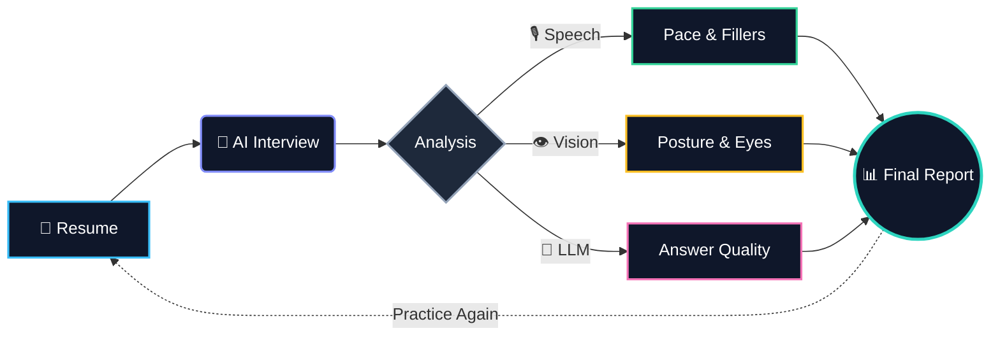
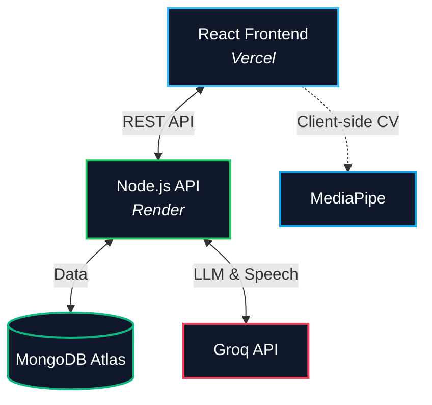

  
  # ✦ INTIX ✦
  
  

  

    An AI-powered interview coaching platform that helps candidates practice realistic interviews, analyze their speech and presentation, and receive actionable feedback to improve their performance.
  

---

## 🎯 Why Intix?

Most interview preparation platforms focus on providing a list of questions, leaving candidates in the dark about their actual performance. You might know *what* to say, but do you know *how* you're saying it?

**Intix turns interview practice into measurable, actionable feedback.**

---

## ✨ Key Features

<table>
  <tr>
    <td>🤖 <b>Personalized AI Interviews</b> Role-aware questions tailored to your resume.</td>
    <td>🎙️ <b>Speech Analysis</b> Real-time transcription and pace tracking.</td>
  </tr>
  <tr>
    <td>👁️ <b>Visual Analysis</b> Client-side tracking of eye contact and posture.</td>
    <td>🧠 <b>Intelligent Feedback</b> Objective scoring on clarity and relevance.</td>
  </tr>
  <tr>
    <td>📈 <b>Performance Trends</b> Track your improvement across multiple sessions.</td>
    <td>📑 <b>Structured Reports</b> Downloadable PDFs with detailed metrics.</td>
  </tr>
</table>

---

## 🔄 How It Works

---

## 🧠 AI & Analysis Engine

<b>💬 Answer Evaluation</b>

Groq's <code>gpt-oss-20b</code> model evaluates the candidate's answer for relevance, completeness, and clarity against the target job role.

<b>🎙️ Speech Pipeline</b>

Powered by <code>whisper-large-v3-turbo</code> for instant speech-to-text, combined with custom algorithms to detect filler words and calculate Words Per Minute (WPM).

<b>👁️ Computer Vision</b>

MediaPipe runs entirely in the browser (100% private) to track facial landmarks and body pose, calculating eye contact consistency and posture stability.

---

## 📊 Reports & Progress Dashboard

Instead of just a score, Intix provides a comprehensive breakdown of your performance.

<table>
  <tr>
    <td width="50%">
      <b>🎯 Scoring & Metrics</b> 
      • Overall Interview Score 
      • Question-level Breakdown 
      • Answered vs. Skipped Ratio
    </td>
    <td width="50%">
      <b>🗣️ Speech & Vision</b> 
      • Words Per Minute (Pace) 
      • Filler Word Count (um, uh, like) 
      • Confidence & Eye Contact %
    </td>
  </tr>
  <tr>
    <td width="50%">
      <b>💡 Actionable Feedback</b> 
      • Identified Strengths 
      • Areas for Improvement 
      • Question-by-Question Tips
    </td>
    <td width="50%">
      <b>📈 Tracking & Export</b> 
      • Historical Performance Trends 
      • Previous Session Archive 
      • Downloadable PDF Reports
    </td>
  </tr>
</table>

---

## ⚙️ Tech Stack

**Frontend:**  

**Backend & Database:**  

**AI & Analysis:**  

---

## 🏗️ Architecture

---

## 🔐 Security

`JWT Auth` `Password Hashing` `Protected Routes` `User Isolation` `Zod Validation` `Rate Limiting` `Helmet Headers` `CORS` `Mongo Sanitization` `In-Memory File Validation`

---

## 💡 What Makes Intix Different?

| Traditional Interview Prep | The Intix Experience |
| :--- | :--- |
| ❌ Static lists of generic questions | ✅ Dynamic questions based on **your resume** |
| ❌ No feedback on delivery | ✅ Real-time **speech pace and filler word** tracking |
| ❌ Blind to body language | ✅ Live **eye contact and posture** analysis |
| ❌ Subjective self-evaluation | ✅ Objective **AI-driven scoring** and feedback |

The goal isn't just to finish an interview. It's to understand exactly how you performed and know precisely what to improve next.

---

### 🎯 Built For

🎓 **Students**
Prepare for campus placements and technical interviews.

💼 **Job Seekers**
Practice role-specific interviews before applying.

🚀 **Developers**
Improve technical communication and presentation.

---

### Ready to practice smarter?

**Practice once. Understand your performance. Come back stronger.**

`Practice → Analyze → Improve`

---

  
  ### 👨‍💻 Built by Prashanth Goud
  
Computer Science Student · Full-Stack Developer · AI Enthusiast

  
  
  

